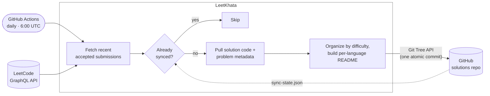

# LeetKhata

> Automatically syncs my accepted LeetCode solutions to GitHub.

## How It Works



**Fetching** — Authenticates with a LeetCode session cookie & CSRF token, queries the GraphQL API for recent accepted submissions, then pulls solution code + problem metadata (difficulty, topics, stats).

**Tracking** — Reads `.leetkhata/sync-state.json` from the solutions repo to skip already-synced submissions.

**Organizing** — Groups solutions by difficulty, one folder per problem. Multiple languages for the same problem live side by side:
```
Easy/1. Two Sum/
├── README.md       ← problem link, runtime stats, topics, submission link
├── solution.cpp
└── solution.py
```

**Committing** — Uses GitHub's Git Tree API to push all files in a single atomic commit — everything goes in or nothing does.

**Scheduling** — Runs daily via GitHub Actions at 6:00 AM UTC, or manually from the Actions tab.

## Config

GitHub Actions secrets: `LEETCODE_SESSION`, `LEETCODE_CSRF_TOKEN`, `GH_PAT` (repo scope).
Variables: `LEETCODE_USERNAME`, `GH_OWNER`, `GH_REPO`.

Non-secret settings in `src/LeetKhata/appsettings.json`:

| Setting | Default | Description |
|---------|---------|-------------|
| `FetchLimit` | `20` | Recent submissions to check per run |
| `GitHubBranch` | `main` | Target branch in the solutions repo |

For local runs, `scripts/refresh-cookies.py` writes cookies to `.env`; the rest of the config goes there too — git-ignored, env vars override it.

## Cookie Refresh

LeetCode cookies expire after about a week.

```bash
python3 scripts/refresh-cookies.py              # cookies -> .env
python3 scripts/refresh-cookies.py --github     # cookies -> GitHub secrets
python3 scripts/refresh-cookies.py --both       # both
```

Reads straight from Chrome — needs an active LeetCode login there, plus `pip install -r scripts/requirements.txt` and `gh auth login` for the GitHub modes.

### Automation

`launchd` (`scripts/com.leetkhata.cookie-refresh.plist.example`) runs the `--github` refresh every 4 days and on login. `RunAtLoad` must be `true` — a `StartInterval`-only job resets on reboot. It also needs its own `PATH`; launchd doesn't inherit the shell's.

## License

MIT
